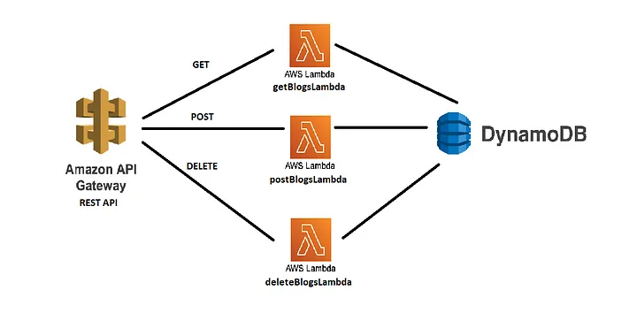

# Serverless REST API with AWS Tutorial

## Introduction

This tutorial walks you through building a Serverless REST API integrated with a database using AWS. We'll leverage various AWS services to construct this Serverless application, allowing us to focus on application logic without worrying about managing servers, which is one of the key advantages of Serverless architecture.

## AWS Services Used

We'll be primarily using the following AWS services to develop our application:

1. **API Gateway (REST API)**: API Gateway enables us to create, publish, maintain, monitor, and secure APIs at any scale.
2. **AWS Lambda**: Lambda lets us run code without provisioning or managing servers. We can execute code in response to triggers such as changes to data in DynamoDB, HTTP requests via API Gateway, or directly through invoking Lambda functions.
3. **DynamoDB (Database)**: DynamoDB is a fully managed NoSQL database service provided by AWS. It offers seamless scalability and low-latency data access for all types of applications.

## Architecture Overview

The architecture of our application will resemble the following:

We'll create an API for a blogging application where multiple authors can post blogs on various topics. Our API will expose endpoints to perform the following operations:

- **GET** all the blogs
- **POST** a particular blog
- **DELETE** a particular blog

## Getting Started

Follow the steps outlined in this tutorial to build and deploy your own Serverless REST API using AWS. This tutorial assumes basic familiarity with AWS services and Serverless concepts. If you're new to these topics, don't worry! We'll provide explanations and guidance along the way. Let's get started!

## Reference

For more detailed instructions, you can refer to the following Medium article:
[Building a Serverless REST API with AWS Lambda, Node.js, and DynamoDB](https://medium.com/@ayushjudesharp/building-a-serverless-rest-api-with-aws-lambda-node-js-and-dynamodb-dd87d3ac90a2)
